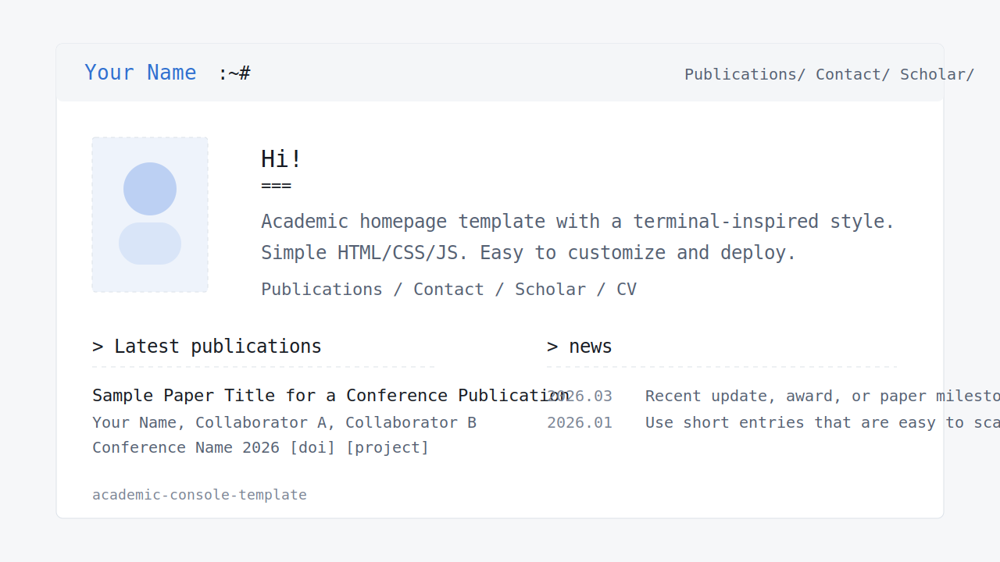

# academic-console-template

[Live Demo](https://hkding0125.github.io/academic-console-template/) · [Use this template](https://github.com/hkding0125/academic-console-template/generate) · [中文说明](README.zh.md)

A terminal-inspired academic homepage template for GitHub Pages and other static hosting.

## Quick Start

Repository URL: `https://github.com/hkding0125/academic-console-template`

If you are new to GitHub Pages, you only need to do these 4 things:

1. Click **Use this template**.
2. Edit `index.html`, `publications.html`, and `contact.html`.
3. Replace the placeholder images in `my-academic-site/images/`.
4. Push your repo and enable GitHub Pages.

That is enough to get a basic version online.

## Beginner Checklist

If you want the simplest path, update these items first:
- your name
- your short introduction
- your publication entries
- your contact links
- your avatar / logo files

You can ignore everything else until the site is already online.

## What is included

- `index.html` — homepage
- `publications.html` — publications page
- `contact.html` — contact page
- `styles.css` — shared styling
- `scripts.js` — theme toggle, modal behavior, and utility scripts
- `my-academic-site/images/` — placeholder images and logos

## Customize this template

### 1. Replace your identity
Edit these files first:
- `index.html`
- `publications.html`
- `contact.html`

Search for:
- `Your Name`
- `example.com`
- sample paper titles
- placeholder institutions and dates

### 2. Replace placeholder assets
Suggested files to replace:
- `my-academic-site/images/avatar-illustration.svg`
- `my-academic-site/images/avatar-photo.svg`
- `my-academic-site/images/institution-a.svg`
- `my-academic-site/images/institution-b.svg`
- `my-academic-site/images/lab.svg`
- `my-academic-site/images/template-preview.svg` (optional)

If you do not need logos, you can remove the image tags in the HTML instead.

### 3. Update site metadata
In `index.html`, update:
- page title
- meta description
- `og:title`
- `og:description`
- `og:image`
- `og:url`
- canonical URL

### 4. Add your own links
Replace placeholder links for:
- Google Scholar
- CV
- ORCID
- GitHub
- personal website
- project/demo links

### 5. Deploy
You can deploy this site with:
- GitHub Pages
- Cloudflare Pages
- Netlify
- any static file host

For GitHub Pages, push the repository and enable Pages from the default branch.

## README languages

This repository includes:
- `README.md` — English
- `README.zh.md` — 中文说明

## Notes

- This template is plain HTML/CSS/JS — it does **not** depend on Hugo.
- The visual style is inspired by [`hugo-theme-console`](https://github.com/mrmierzejewski/hugo-theme-console/), but implemented independently.

## Suggested cleanup after using this template

Before publishing your own site, make sure you have removed:
- placeholder names
- sample publication entries
- example links
- unused placeholder assets
